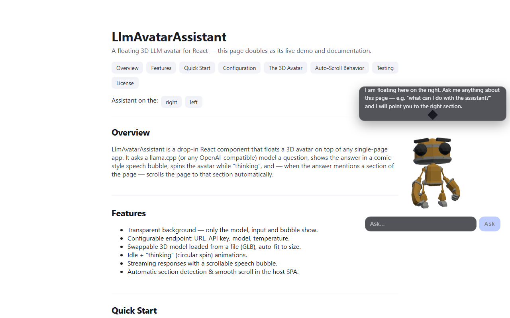
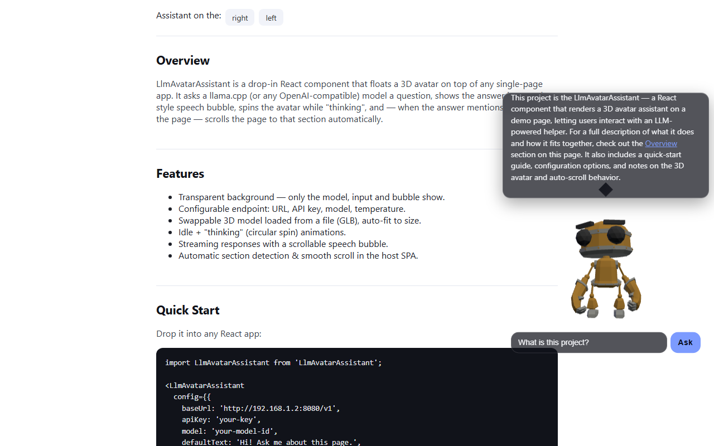

# LlmAvatarAssistant

A **floating 3D LLM avatar** for React 19. It sits on top of any single-page
app with a transparent background and shows exactly three things:

1. **A 3D avatar** (three.js, loaded from a swappable GLB file) that **spins in
   circles while it is "thinking"**.
2. **A comic-style speech bubble** (scrollable, auto-grows) showing the
   model's answer.
3. **A question input** field below the avatar.

It talks to **any llama.cpp / OpenAI-compatible endpoint**, and when the answer
**mentions a section of the page it auto-scrolls the SPA to that section** —
with the matched title highlighted in the bubble.

This repo is the component **plus a live portfolio-style demo SPA** that
doubles as its documentation, so you can watch it run against a real model.





---

## Why this shape

| Requirement | How it is met |
|---|---|
| Float left or right of the screen | `side="left\|right"` (or `corner`) — `position: fixed` |
| 3D avatar that animates while querying | three.js canvas; a pivot **orbits the whole model** when busy, idles otherwise |
| Answer shown as a comic speech bubble above the avatar | `.lav-bubble` with a comic tail; scrollable; grows to a max then scrolls |
| Question field (may go below the others) | placed **below** the avatar, per the brief |
| Configure endpoint (llama.cpp or compatible: url / key / model) | `config.baseUrl`, `config.apiKey`, `config.model`, `config.temperature` |
| Configurable default text | `config.defaultText` |
| Model loaded from a file, easily replaceable | `config.modelUrl` points at any `.glb`; **auto-fit** measures the bounding box on load so a new model is never too big or too small |
| Transparent background (only the 3 parts visible) | `alpha: true` renderer + transparent root; no page background, no borders |
| Answer can reference SPA sections → auto-scroll | `sectionScanner` detects a section title/id in the answer and smooth-scrolls to it |

---

## Quick start

```bash
npm install
npm run dev            # starts Vite on :5173 (proxies /v1 to your llama.cpp)
```

Open http://127.0.0.1:5173, ask the assistant something, and watch it answer,
spin, and scroll the page.

> For the demo to talk to your model you need a `.env.local` (see
> [Configuration](#configuration)). The demo uses the Vite **dev proxy** so the
> API key is injected **server-side** and never reaches the browser or git.

### Run the tests

```bash
npm test               # 34 unit tests (Vitest) — offline, no model needed
npm run e2e            # 2 Playwright tests, one of which is LIVE against your model
```

The E2E suite spins up the dev server and drives the real component against a
real model: it asks a question, asserts the answer appears, and asserts the
page **scrolled to the section the model referenced**. It only hits the model
when you run `npm run e2e` (set `LLM_E2E=0` to skip the live test).

---

## Usage in your own app

```jsx
import LlmAvatarAssistant from './components/LlmAvatarAssistant';

<LlmAvatarAssistant
  config={{
    baseUrl: 'http://192.168.1.2:8080/v1', // your llama.cpp router
    apiKey: 'your-key',
    model: 'your-model-id',
    defaultText: 'Hi! Ask me anything about this page.',
    modelUrl: '/models/robot.glb',
    side: 'right',                 // or 'left'
    // streaming: true,            // default; false for one-shot responses
    // sectionDiscovery: 'auto',   // or an explicit list, see below
  }}
/>
```

Because the component is fully self-contained, you can lift the
`src/components/LlmAvatarAssistant/` folder (and its three dependencies:
`react`, `three`) into any project.

### Configuration reference

| Key | Default | Description |
|---|---|---|
| `baseUrl` | `/v1` | OpenAI-compatible base URL. A relative `/v1` resolves same-origin (use the dev proxy or a same-origin backend); an absolute `http(s)` URL works when the server allows CORS. |
| `apiKey` | `''` | Bearer token. Empty when the server is unsecured or the proxy injects it. |
| `model` | `'default'` | Model id sent in the payload. |
| `temperature` | `0.7` | Sampling temperature. |
| `defaultText` | *a greeting* | Shown in the bubble before the first question. |
| `modelUrl` | `models/robot.glb` | Path to the GLB avatar file. **Change this to swap the model.** |
| `side` | `right` | `left` or `right`. |
| `corner` | `null` | Optional `bottom-left` / `bottom-right` (overrides `side`). |
| `maxBubbleHeight` | `240` | Max bubble height (px) before it scrolls. |
| `streaming` | `true` | Stream tokens as they arrive. |
| `sectionDiscovery` | `'auto'` | `'auto'` reads every `<section id>`/`<h2 id>`; or pass `[{id, title, aliases[]}]`. |
| `systemPrompt` | *a concise persona* | Persona + instructions. The demo's prompt tells the model to name a section by its exact title. |
| `timeoutMs` | `120000` | Request timeout (local models can be slow on the first token). |

### Section auto-scroll

With `sectionDiscovery: 'auto'`, the component scans the document for
`<section id>` and `<h2 id>` elements and treats each heading text (and a
slugified id) as a matchable alias. After an answer it looks for the first
section whose title/alias/id appears in the text (case- and diacritic-
insensitive, whole-word). On a match it smooth-scrolls there and highlights the
matched text in the bubble.

Give your page sections stable ids — the demo does exactly this:

```html
<section id="configuration"><h2>Configuration</h2>…</section>
```

For a strict, known set of targets, pass an explicit list:

```jsx
config={{
  sectionDiscovery: [
    { id: 'overview', title: 'Overview' },
    { id: 'quick-start', title: 'Quick Start', aliases: ['getting started'] },
  ],
}}
```

---

## Configuration (this demo)

Create `.env.local` in the project root (it is git-ignored):

```ini
# Where the /v1 dev proxy forwards requests (your llama.cpp router)
VITE_LLM_PROXY_TARGET=http://127.0.0.1:8080
# API key — injected into proxied requests server-side; the browser never sees it
VITE_LLM_PROXY_KEY=your-key
# Model id the demo uses by default
VITE_LLM_MODEL=FG-Inteligencia
```

A `.env.example` with these keys (no secrets) is committed. A relative
`baseUrl: '/v1'` in the demo resolves to the proxy above; to skip the proxy
entirely, set `baseUrl` to the absolute router URL in `src/App.jsx` (the model
server must then allow cross-origin requests).

### llama.cpp router / multi-model

Works with a single `llama-server` or a llama.cpp **router** exposing several
models under one `/v1`. Pick any served model id for `model`. Note a router may
load a model on the first request (a one-off warm-up latency).

---

## Swapping the 3D model

1. Drop any `.glb` (glTF binary — the most common single-file 3D format) into
   `public/models/`, e.g. `public/models/my-robot.glb`.
2. Set `config.modelUrl` to `models/my-robot.glb`.
3. Done. **Auto-fit** measures the model's bounding box on load and scales +
   recentres it into the fixed viewport, so the new model fits whether it is
   huge, tiny, or offset. If the file fails to load, a built-in placeholder
   robot keeps the component working.

The bundled model is three.js **RobotExpressive** (public domain / CC0) — a
low-poly robot with built-in idle animation clips, so the project is fully free
to use and redistribute.

---

## Architecture

```
src/
  main.jsx                     # entry
  App.jsx                      # demo portfolio SPA (the host with sections)
  styles.css                   # component + demo styling
  components/LlmAvatarAssistant/
    index.js                   # barrel export
    LlmAvatarAssistant.jsx     # the component (bubble + avatar + input + state)
    AvatarCanvas.jsx           # three.js viewport: load, auto-fit, idle/think, fallback
    llmClient.js               # OpenAI-compatible chat (stream + non-stream), fetch-injectable
    sectionScanner.js          # section discovery + reference matching + scroll
    autoFit.js                 # bounding-box → scale/position math (pure)
    utils.js                   # text normalisation + lightweight markdown cleanup
test/                          # Vitest unit tests (offline)
e2e/                           # Playwright tests (one live vs the real model)
public/models/robot.glb        # the CC0 avatar model
```

Key design points:

- **`llmClient`** injects `fetch`, so the whole chat path is unit-tested with a
  fake endpoint and needs no network. It supports SSE streaming **and** a
  non-streaming fallback (some proxies ignore `stream:true`).
- **`sectionScanner`** is DOM-only (no three.js) and fully testable under jsdom.
- **`autoFit`** is pure math over a bounding box — the same numbers a unit test
  checks are the numbers that size the model on screen.
- **`AvatarCanvas`** is isolated behind an **error boundary**: a WebGL/three.js
  failure (e.g. in headless or constrained GPUs) degrades to a 2D placeholder
  instead of unmounting the chat UI.
- **Reasoning models**: llama.cpp `MuseGlimmer`-style models return their
  chain-of-thought in `reasoning_content` and the real answer in `content`; the
  client reads `content`, so it works with or without reasoning.

## Testing notes

- **Unit (34)**: client request shape / streaming / error paths, config
  validation, section discovery + matching (whole-word, diacritics), auto-fit
  scaling/centering, and the component (renders the 3 parts, positions left/
  right, streams an answer, detects + scrolls to a referenced section, error
  states).
- **E2E (2)**: static render (page + component + canvas present) and a **live**
  run against the real model that asserts the answer + the page auto-scrolling
  to the referenced section.

## Scripts

| Command | What it does |
|---|---|
| `npm run dev` | Vite dev server on :5173 with the `/v1` proxy |
| `npm run build` | Production build to `dist/` |
| `npm run preview` | Serve the production build |
| `npm test` | Unit tests (Vitest, offline) |
| `npm run e2e` | Playwright tests (incl. one live model test) |

## Troubleshooting

- **Empty answer with a reasoning model**: if you only get `reasoning_content`,
  raise `max_tokens`/`timeoutMs` so the model finishes its chain of thought.
- **CORS / network errors in the browser**: use the dev proxy (`/v1`) or ensure
  the model server sends `Access-Control-Allow-Origin` for an absolute URL.
- **Avatar too big/small**: it is auto-fit automatically; if a model still looks
  off, adjust `autoFit.maxFraction` (default `0.8`) in the component.
- **No WebGL**: the avatar degrades to a placeholder; the chat still works.

## License

MIT — see [LICENSE](LICENSE). The bundled `robot.glb` is three.js
**RobotExpressive** (CC0 / public domain).
